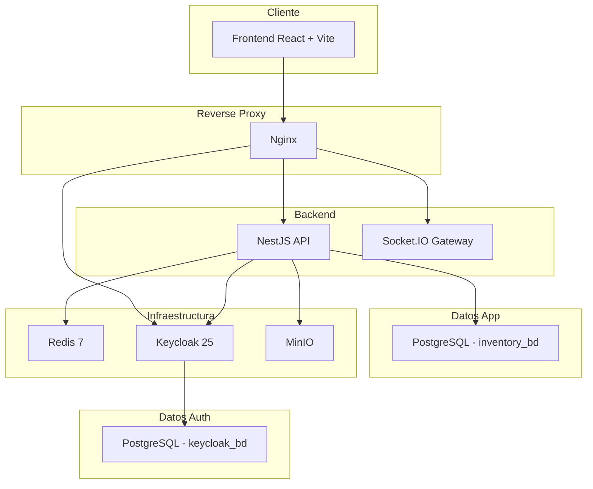
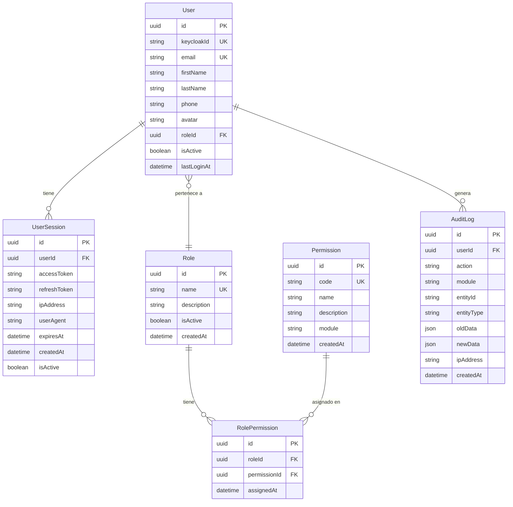
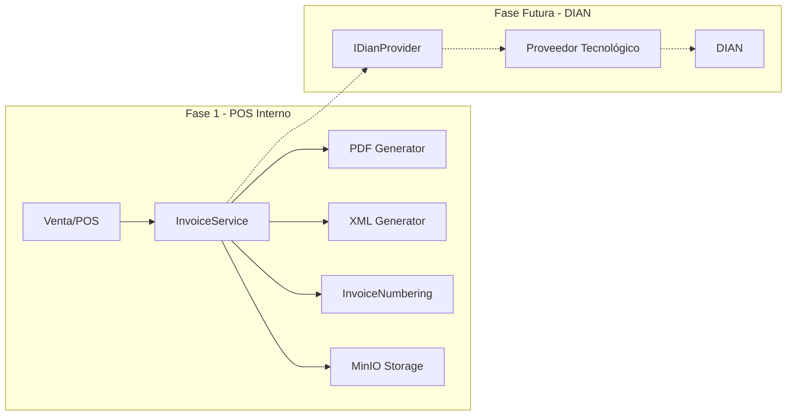

# Sistema Empresarial de Inventario, Ventas y POS — Plan Corregido

## Resumen

Sistema empresarial completo para gestión de inventario, ventas, caja y POS para negocios colombianos. Monorepo con React + NestJS, desplegado con Docker Compose en Windows 11.

> [!IMPORTANT]
> Este plan incorpora los **10 ajustes obligatorios** solicitados por el usuario.

---

## Ajustes Aplicados

| # | Ajuste | Estado |
|---|--------|--------|
| 1 | Roles exactos: `SUPER_ADMINISTRADOR`, `ADMINISTRADOR`, `CAJERO` | ✅ |
| 2 | Permisos normalizados con tablas `RolePermission` (no `String[]`) | ✅ |
| 3 | Bases separadas: `inventory_bd` + `keycloak_bd` | ✅ |
| 4 | Facturación DIAN desacoplada con interfaz preparada | ✅ |
| 5 | TailwindCSS v3 (compatibilidad shadcn/ui) | ✅ |
| 6 | Keycloak por fases (Fase 1: JWT básico, Fase 2: integración completa) | ✅ |
| 7 | Seeds obligatorios (roles, permisos, RolePermission) | ✅ |
| 8 | Matriz de permisos completa por rol | ✅ |
| 9 | Fase 1 con código funcional completo | ✅ |
| 10 | Scripts para Windows 11 | ✅ |

---

## Arquitectura General



---

## Modelo de Datos Normalizado — RBAC

### Diagrama ER de Permisos



### Prisma Schema — Modelos RBAC

```prisma
enum RoleName {
  SUPER_ADMINISTRADOR
  ADMINISTRADOR
  CAJERO
}

model Role {
  id          String   @id @default(uuid())
  name        RoleName @unique
  description String?
  isActive    Boolean  @default(true)
  createdAt   DateTime @default(now())
  updatedAt   DateTime @updatedAt

  users           User[]
  rolePermissions RolePermission[]

  @@map("roles")
}

model Permission {
  id          String   @id @default(uuid())
  code        String   @unique    // e.g. "products.create"
  name        String               // e.g. "Crear Productos"
  description String?
  module      String               // e.g. "products"
  createdAt   DateTime @default(now())

  rolePermissions RolePermission[]

  @@map("permissions")
}

model RolePermission {
  id           String   @id @default(uuid())
  roleId       String
  permissionId String
  assignedAt   DateTime @default(now())

  role       Role       @relation(fields: [roleId], references: [id])
  permission Permission @relation(fields: [permissionId], references: [id])

  @@unique([roleId, permissionId])
  @@map("role_permissions")
}

model User {
  id          String    @id @default(uuid())
  keycloakId  String?   @unique
  email       String    @unique
  firstName   String
  lastName    String
  phone       String?
  avatar      String?
  roleId      String
  isActive    Boolean   @default(true)
  lastLoginAt DateTime?
  createdAt   DateTime  @default(now())
  updatedAt   DateTime  @updatedAt

  role     Role          @relation(fields: [roleId], references: [id])
  sessions UserSession[]
  audits   AuditLog[]

  @@map("users")
}

model UserSession {
  id           String   @id @default(uuid())
  userId       String
  accessToken  String
  refreshToken String?
  ipAddress    String?
  userAgent    String?
  expiresAt    DateTime
  isActive     Boolean  @default(true)
  createdAt    DateTime @default(now())

  user User @relation(fields: [userId], references: [id])

  @@map("user_sessions")
}

model AuditLog {
  id         String   @id @default(uuid())
  userId     String?
  action     String
  module     String
  entityId   String?
  entityType String?
  oldData    Json?
  newData    Json?
  ipAddress  String?
  createdAt  DateTime @default(now())

  user User? @relation(fields: [userId], references: [id])

  @@map("audit_logs")
}
```

---

## Matriz de Permisos Completa

### Permisos del Sistema

| Módulo | Código | SUPER_ADMINISTRADOR | ADMINISTRADOR | CAJERO |
|--------|--------|:---:|:---:|:---:|
| **Dashboard** | `dashboard.view` | ✅ | ✅ | ✅ |
| **Dashboard** | `dashboard.view_analytics` | ✅ | ✅ | ❌ |
| **Productos** | `products.view` | ✅ | ✅ | ✅ |
| **Productos** | `products.create` | ✅ | ✅ | ❌ |
| **Productos** | `products.update` | ✅ | ✅ | ❌ |
| **Productos** | `products.delete` | ✅ | ❌ | ❌ |
| **Categorías** | `categories.view` | ✅ | ✅ | ✅ |
| **Categorías** | `categories.create` | ✅ | ✅ | ❌ |
| **Categorías** | `categories.update` | ✅ | ✅ | ❌ |
| **Categorías** | `categories.delete` | ✅ | ❌ | ❌ |
| **Inventario** | `inventory.view` | ✅ | ✅ | ✅ |
| **Inventario** | `inventory.adjust` | ✅ | ✅ | ❌ |
| **Kardex** | `kardex.view` | ✅ | ✅ | ❌ |
| **Proveedores** | `suppliers.view` | ✅ | ✅ | ❌ |
| **Proveedores** | `suppliers.create` | ✅ | ✅ | ❌ |
| **Proveedores** | `suppliers.update` | ✅ | ✅ | ❌ |
| **Proveedores** | `suppliers.delete` | ✅ | ❌ | ❌ |
| **Compras** | `purchases.view` | ✅ | ✅ | ❌ |
| **Compras** | `purchases.create` | ✅ | ✅ | ❌ |
| **Compras** | `purchases.update` | ✅ | ✅ | ❌ |
| **Compras** | `purchases.delete` | ✅ | ❌ | ❌ |
| **Ventas** | `sales.view` | ✅ | ✅ | ✅ |
| **Ventas** | `sales.create` | ✅ | ✅ | ✅ |
| **Ventas** | `sales.cancel` | ✅ | ✅ | ❌ |
| **Ventas** | `sales.refund` | ✅ | ❌ | ❌ |
| **POS** | `pos.access` | ✅ | ✅ | ✅ |
| **POS** | `pos.apply_discount` | ✅ | ✅ | ❌ |
| **POS** | `pos.suspend_sale` | ✅ | ✅ | ✅ |
| **POS** | `pos.resume_sale` | ✅ | ✅ | ✅ |
| **Clientes** | `customers.view` | ✅ | ✅ | ✅ |
| **Clientes** | `customers.create` | ✅ | ✅ | ✅ |
| **Clientes** | `customers.update` | ✅ | ✅ | ❌ |
| **Clientes** | `customers.delete` | ✅ | ❌ | ❌ |
| **Caja** | `cash_register.open` | ✅ | ✅ | ✅ |
| **Caja** | `cash_register.close` | ✅ | ✅ | ✅ |
| **Caja** | `cash_register.movement` | ✅ | ✅ | ✅ |
| **Caja** | `cash_register.view_all` | ✅ | ✅ | ❌ |
| **Facturación** | `invoices.view` | ✅ | ✅ | ✅ |
| **Facturación** | `invoices.generate` | ✅ | ✅ | ✅ |
| **Facturación** | `invoices.create` | ✅ | ✅ | ✅ |
| **Facturación** | `invoices.cancel` | ✅ | ✅ | ❌ |
| **Facturación** | `invoices.reprint` | ✅ | ✅ | ✅ |
| **Facturación** | `invoices.config` | ✅ | ❌ | ❌ |
| **Reportes** | `reports.view` | ✅ | ✅ | ❌ |
| **Reportes** | `reports.export` | ✅ | ✅ | ❌ |
| **Usuarios** | `users.view` | ✅ | ✅ | ❌ |
| **Usuarios** | `users.create` | ✅ | ❌ | ❌ |
| **Usuarios** | `users.update` | ✅ | ❌ | ❌ |
| **Usuarios** | `users.delete` | ✅ | ❌ | ❌ |
| **Roles** | `roles.view` | ✅ | ❌ | ❌ |
| **Roles** | `roles.manage` | ✅ | ❌ | ❌ |
| **Auditoría** | `audit.view` | ✅ | ✅ | ❌ |
| **Configuración** | `settings.view` | ✅ | ✅ | ❌ |
| **Configuración** | `settings.update` | ✅ | ❌ | ❌ |
| **Backups** | `backups.create` | ✅ | ❌ | ❌ |
| **Backups** | `backups.restore` | ✅ | ❌ | ❌ |
| **Documentos** | `documents.view` | ✅ | ✅ | ✅ |
| **Documentos** | `documents.upload` | ✅ | ✅ | ❌ |
| **Documentos** | `documents.delete` | ✅ | ❌ | ❌ |
| **Monitoreo** | `monitoring.view` | ✅ | ❌ | ❌ |

> **Ventas (implementación):** API `GET/POST /sales`, `POST /sales/:id/cancel`, `POST /sales/:id/refund`. Creación valida pagos vs total, descuenta inventario y escribe kardex OUT en transacción. `sales.refund` solo **SUPER_ADMINISTRADOR** en seed (reembolso sensible). El POS usa `sales.create` para cobrar (`pos.controller`).

---

## Bases de Datos Separadas

```yaml
# docker-compose.yml (extracto)
services:
  postgres-app:
    image: postgres:17-alpine
    environment:
      POSTGRES_DB: inventory_bd
      POSTGRES_USER: inventory_user
      POSTGRES_PASSWORD: ${DB_APP_PASSWORD}
    volumes:
      - postgres_app_data:/var/lib/postgresql/data
    ports:
      - "5432:5432"

  postgres-keycloak:
    image: postgres:17-alpine
    environment:
      POSTGRES_DB: keycloak_bd
      POSTGRES_USER: keycloak_user
      POSTGRES_PASSWORD: ${DB_KC_PASSWORD}
    volumes:
      - postgres_kc_data:/var/lib/postgresql/data
    # No expone puerto externo

  keycloak:
    image: quay.io/keycloak/keycloak:25.0
    environment:
      KC_DB: postgres
      KC_DB_URL: jdbc:postgresql://postgres-keycloak:5432/keycloak_bd
      KC_DB_USERNAME: keycloak_user
      KC_DB_PASSWORD: ${DB_KC_PASSWORD}
    depends_on:
      - postgres-keycloak
```

---

## Keycloak por Fases

### Fase 1 — Keycloak Básico (esta entrega)
- Contenedor Docker con realm `inventory`
- Cliente `inventory-app` (public, SPA)
- Roles: `SUPER_ADMINISTRADOR`, `ADMINISTRADOR`, `CAJERO`
- Validación JWT en NestJS (`passport-jwt` + `jwks-rsa`)
- Realm export JSON versionado en el repo
- Usuario admin seedeado

### Fase 2 — Keycloak Avanzado (implementado en código; ajustes operativos en Keycloak)
- **Rotación de refresh token:** en `keycloak/realm-export.json` el realm tiene `revokeRefreshToken: true` y `refreshTokenMaxReuse: 0`. El SPA usa `keycloak-js` con `onTokenExpired` → `updateToken(70)` y las llamadas API pasan por `withFreshAccessToken()` antes de `fetch`.
- **Sincronización bidireccional:** en login, JWT + `AuthService.syncUser` (Keycloak → BD). Alta/edición de usuario en la app sigue propagando a Keycloak (`KeycloakAdminService`). Batch **KC → BD** para usuarios ya existentes: `POST /users/sync-from-keycloak` (permiso `settings.update`, rol SUPER en seed).
- **UserSession:** al validar `/auth/me`, el frontend registra sesión con `POST /auth/sessions`; logout llama `DELETE /auth/sessions/current` (cabecera opcional `X-App-Session-Id`). Revocación por usuario en backend (`UserSessionsService`).
- **Webhooks Keycloak:** `POST /api/auth/keycloak/webhook` protegido por `KEYCLOAK_WEBHOOK_SECRET` y cabecera `X-Inventory-Webhook-Secret`. El cuerpo admite eventos estilo admin (`operationType`, `resourceType`, `representation`). Keycloak no emite webhooks HTTP por defecto: hace falta un listener de eventos (SPI/extension) o un proceso que reenvíe desde el log de auditoría hacia esa URL.
- **MFA/2FA:** política OTP (TOTP) en el export del realm; obligar OTP o WebAuthn en los flujos de autenticación se configura en la consola de Keycloak (browser flow) o ampliando el JSON de realm/flows según política de la organización.

---

## Facturación — Diseño Desacoplado

### Arquitectura de Facturación



### Interfaz Desacoplada para DIAN

```typescript
// src/modules/invoices/interfaces/dian-provider.interface.ts

export interface IDianProvider {
  /** Enviar factura electrónica a la DIAN */
  sendInvoice(invoice: DianInvoicePayload): Promise<DianResponse>;

  /** Consultar estado de factura en DIAN */
  getInvoiceStatus(trackId: string): Promise<DianStatusResponse>;

  /** Enviar nota crédito */
  sendCreditNote(note: DianCreditNotePayload): Promise<DianResponse>;

  /** Validar NIT/documento */
  validateDocument(doc: string): Promise<DianValidationResponse>;
}

export interface DianInvoicePayload {
  prefix: string;
  number: number;
  issueDate: Date;
  customer: { documentType: string; documentNumber: string; name: string; };
  items: DianInvoiceItem[];
  totals: { subtotal: number; taxTotal: number; total: number; };
  resolutionNumber: string;
}

export interface DianResponse {
  success: boolean;
  trackId?: string;
  cufe?: string;
  errors?: string[];
}
```

```typescript
// src/modules/invoices/providers/internal-invoice.provider.ts
// Implementación Fase 1: solo genera PDF/XML local, sin enviar a DIAN

@Injectable()
export class InternalInvoiceProvider implements IDianProvider {
  async sendInvoice(invoice: DianInvoicePayload): Promise<DianResponse> {
    // Fase 1: Solo almacena localmente, retorna éxito
    return { success: true, trackId: `LOCAL-${Date.now()}` };
  }
  // ... otros métodos con implementación stub
}
```

### Implementación en repositorio (facturación electrónica)

| Elemento | Estado |
|----------|--------|
| `IDianProvider` + inyección `DIAN_PROVIDER` | ✅ |
| `InternalInvoiceProvider` (stub local) | ✅ |
| `HttpDianProvider` opcional (`DIAN_PROVIDER_MODE=http` + `DIAN_HTTP_API_BASE`) | ✅ |
| CUFE SHA-384, XML UBL 2.1, PDF con QR catálogo VP, persistencia `cufe` / `qrPayload` / `electronicTrackId` | ✅ |
| Emisor: `ElectronicInvoiceConfigService` (`company.*` en BD + variables `ELECTRONIC_INVOICING_*`) | ✅ |
| API `GET /api/invoices/electronic/status?trackId=`, `POST /api/invoices/electronic/validate-document` | ✅ |
| Anulación de factura → `sendCreditNote` en el proveedor antes de marcar cancelada | ✅ |
| Permiso `invoices.generate` (matriz del plan) con compatibilidad `invoices.create` en rutas | ✅ |
| UI Facturación: integración PT (estado / validar), descargas PDF/XML/QR | ✅ |

Queda **fuera del código** del monorepo: firma XAdES, registro de software ante la DIAN y el contrato JSON concreto de cada proveedor tecnológico.

---

## Estructura del Monorepo

```
d:\SOFTWARE\INVENTORY\
├── docker-compose.yml
├── docker-compose.prod.yml
├── .env.example
├── .gitignore
├── README.md
│
├── frontend/                    # React + Vite + TailwindCSS v3
│   ├── Dockerfile
│   ├── package.json
│   ├── vite.config.ts
│   ├── tailwind.config.js       # Tailwind v3 config
│   ├── postcss.config.js
│   ├── components.json          # shadcn/ui config
│   └── src/
│       ├── main.tsx
│       ├── App.tsx
│       ├── index.css
│       ├── components/
│       │   ├── ui/              # shadcn/ui
│       │   ├── layout/          # Shell, Sidebar, Header
│       │   └── shared/
│       ├── features/
│       ├── hooks/
│       ├── lib/
│       ├── stores/              # Zustand
│       ├── types/
│       └── router.tsx
│
├── backend/                     # NestJS + Prisma
│   ├── Dockerfile
│   ├── package.json
│   ├── prisma/
│   │   ├── schema.prisma        # Tablas normalizadas
│   │   ├── seed.ts              # Seeds obligatorios
│   │   └── migrations/
│   └── src/
│       ├── main.ts
│       ├── app.module.ts
│       ├── common/
│       │   ├── guards/
│       │   ├── decorators/
│       │   ├── filters/
│       │   └── interceptors/
│       ├── config/
│       ├── prisma/
│       ├── redis/
│       ├── auth/                # Keycloak JWT
│       ├── storage/             # MinIO
│       └── modules/           # productos, dashboard, backups (pg_dump), …
│
├── keycloak/
│   └── realm-export.json        # Realm inventory
│
├── nginx/
│   ├── nginx.conf
│   └── conf.d/default.conf
│
└── scripts/
    ├── setup.ps1                # Setup Windows 11
    ├── seed.ps1
    └── backup.ps1
```

---

## Infraestructura Docker

| Servicio | Imagen | Puerto | BD |
|----------|--------|--------|----|
| `postgres-app` | postgres:17-alpine | 5432 | `inventory_bd` |
| `postgres-keycloak` | postgres:17-alpine | — | `keycloak_bd` |
| `keycloak` | keycloak:25.0 | 8080 | usa `keycloak_bd` |
| `redis` | redis:7-alpine | — | — |
| `minio` | minio/minio | 9000/9001 | — |
| `nginx` | nginx:alpine | 80 | — |
| `frontend` | Build local | — | — |
| `backend` | Build local | 3000 | usa `inventory_bd` |

---

## Monitoreo

| Recurso | URL / uso |
|---------|-----------|
| **Netdata** (host y contenedores) | `http://localhost:${NETDATA_PORT:-19999}` — definido en `docker-compose.yml` |
| **API liveness** | `GET /api/health/live` — **200** si el proceso Nest responde (sin consultar la BD) |
| **API readiness** | `GET /api/health/ready` — **200** si PostgreSQL responde; **503** si la BD falla |
| **API estado (legible)** | `GET /api/health` — **siempre 200**; cuerpo con `status: ok \| degraded` y `services` (+ `version`) |
| **Docker** | Servicio `backend`: `healthcheck` con `wget` (incluido en `node:alpine`) contra `/api/health/live` |

Los endpoints de salud son públicos (sin JWT). Para balanceadores u orquestadores, usar **`live`** para reinicios y **`ready`** para quitar tráfico cuando la BD no esté disponible.

---

## Diseño Visual

- **TailwindCSS v3** con `tailwind.config.js` y PostCSS
- **shadcn/ui** compatible con Tailwind v3
- **Paleta**: Modo oscuro tipo Linear/Vercel (zinc-950 base, indigo-500 accent)
- **Tipografía**: Inter + JetBrains Mono
- **Componentes**: TanStack Table, React Hook Form + Zod, Sonner, Recharts, Framer Motion

---

## Entregables Fase 1 (Código Funcional)

| Entregable | Descripción |
|------------|-------------|
| `docker-compose.yml` | Todos los servicios con 2 PostgreSQL separados |
| `.env.example` | Variables para app, Keycloak, Redis, MinIO |
| Backend NestJS | App module, Prisma, Auth guard, Permissions guard, Health endpoint |
| Frontend React | Vite + Tailwind v3 + shadcn/ui + Layout shell + Login + Router |
| Prisma Schema | Tablas: User, Role, Permission, RolePermission, UserSession, AuditLog + modelos de negocio |
| Seed | 3 roles + ~55 permisos + RolePermission matrix + usuario super admin |
| Keycloak | Realm `inventory`, cliente `inventory-app`, 3 roles, realm-export.json |
| Nginx | Reverse proxy para frontend, API y Keycloak |
| Scripts | `setup.ps1` para Windows 11 (Docker check, build, migrate, seed, start) |

---

## Verification Plan

### Automated Tests
- `docker compose build` — build sin errores
- `docker compose up -d` — todos los servicios healthy
- `npx prisma migrate deploy` — migraciones OK
- `npx prisma db seed` — seed de roles, permisos y RolePermission
- `curl -fsS http://localhost/api/health/live` — liveness
- `curl -fsS http://localhost/api/health/ready` — readiness (**falla con 503** si la BD cae; usar `curl -f` para scripts)
- `curl -fsS http://localhost/api/health` — siempre 200; revisar JSON `status` y `services.database`
- `curl http://localhost` — frontend carga

### Manual Verification
- Login con Keycloak funcional
- Guard de permisos bloquea endpoints según rol
- Shell del frontend renderiza sidebar/header
- Ambas bases de datos (`inventory_bd`, `keycloak_bd`) existen y tienen datos
